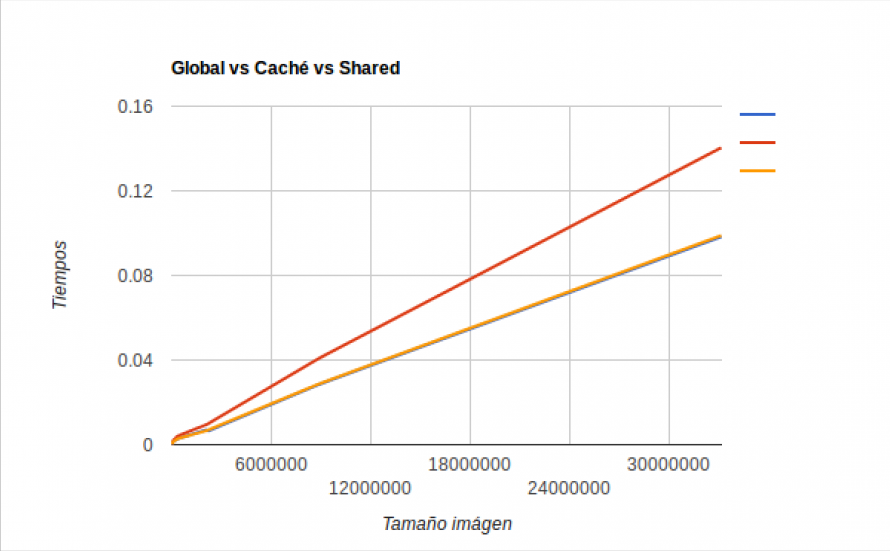
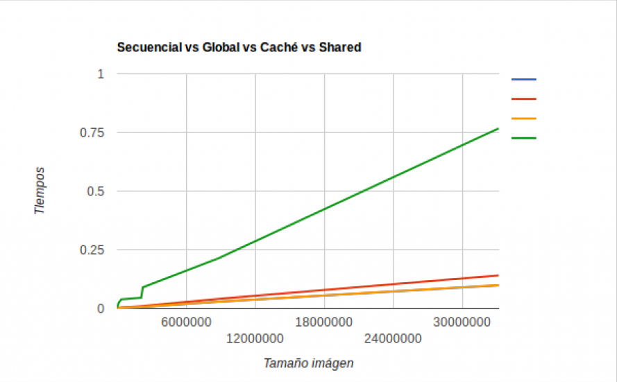

# A continuación se muestra un comparativo entre el procesamiento efectuado por una CPU y el hecho a partir de una GPU en el procesamiento de imágenes.

## Método de comparativa.
Para realizar este marco comparativo se implementó el filtro de Sobel en cuatro medidas diferentes, que si somos más rigurosos serían dos en total, estas son Secuencial (Implementada en CPU), Memoria Compartida, Memoria Caché y Memoria Global, que en resumidas cuentas son procesamiento paralelo (Implementada en GPU). Para implementar este filtro se hace un proceso de convolución el cual consiste en aplicar la matriz específica del filtro además de su forma aritmética, esto en una función de barrido en x, y su transpuesta en una función de barrido y. esta matriz la utilizamos en términos de matriz aplanada o vector, que recibe el nombre de kernel el cual va ser aplicado en cada pixel de la imágen.

Para realizar la toma de datos se utilizaron 8 tamaños de imágenes diferentes. Estos tamaños se seleccionaron a partir de diferentes resoluciones de pantalla que encontramos en la cotidianidad. Estas resoluciones son:
90p, 180p, 480p, 720p, 1080p, 2k, 4k y 8k. Cada tamaño de imágen fue puesto en ejecución tanto en el algoritmo secuencial (CPU) como en las implementaciones paralelas mencionadas anteriormente (GPU) un total de 10 veces.

## Objetivos.
* Se busca entender el comportamiento que toman los datos en diferentes entornos de ejecución.
* Validar qué beneficios tiene utilizar alguno de estos entornos así como sus contras.
* Comparar las implementaciones realizadas utilizando Shared Memory, Caché Memory y Global Memory.

## Tabla de datos obtenidos.
## Shared.

Toma de datos | Tiempo|
-------------|------------
 33177600| 0.09827
8847660  |0.028325
2211840 | 0.00651
2073600 |0.006932
345600 |0.002797
86400 |0.001399
16200 |0.000397
6300 |0.000119

## Global.
Toma de datos | Tiempo|
-------------|------------
 33177600| 0.140385
  8847660  |0.040619
2211840 | 0.009958
2073600 |0.009412
345600 |0.004045
86400 |0.001968
16200 |0.000563
6300 |0.000169

## Caché.

Toma de datos | Tiempo|
-------------|------------
 33177600| 0.098868
  8847660  |0.028573
2211840 | 0.006964
2073600 |0.006572
345600 |0.002793
86400 |0.001383
16200 |0.000393
6300 |0.000117

## Secuencial.

Toma de datos | Tiempo|
-------------|------------
 33177600| 0.767069
  8847660  |0.214468
2211840 |0.089331
2073600 |0.045248
345600 |0.038524
86400 |0.021627
16200 |0.007113
6300 |0.004092

## Gráfica comparativa de los algoritmos que usan la GPU.
### Verde para Memoria Caché, rojo Global y azul Shared.

## Gráfica comparativa de los algoritmos que usan la GPU y el ejecutado en CPU.
### Verde para la implementación secuencial, rojo Global, naranja Caché y azul Shared.

## Conclusiones
* En los resultados obtenidos se ve como la implementación Caché y Global tienen tiempos muy similares.
* De manera muy convincente el filtro de sobel implementado de manera paralela (uso de la GPU), arroja tiempos más bajos que los obtenidos por el procesamiento que realiza el algoritmo secuencial (uso de la CPU).
* El uso de matriz aplanada (vector). Genera tiempos con gráficas constantes.
* Resulta ser más eficiente la implementación con memoria compartida.
