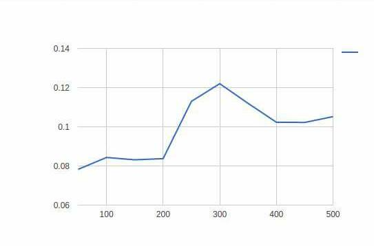

# A continuación se muestra un comparativo entre el procesamiento por medio de CPU y el hecho a partir de una GPU, aplicado a una multipliación de matrices.

## Método de comparativo:

Para realizar las pruebas se tomaron 15 datos diferentes para un tamaño de matriz aplananada en específico, se tienen 10 valores   diferentes para dicho tamaño para eliminar el ruido entre datos, para ver el comportamiento en términos de tiempo que resulta al ejecutar dos algoritmos diferentes tanto en el ámbito secuencial (CPU) como en el paralelo (GPU), que se traduce en mayor número de bloques y de hilos en las pruebas.

Posteriormente se implementó un método Tiling, que separa la ejecución de la multiplicación en segmentos para hacer más eficaz el procesamiento de dicha operación

## Objetivos

Se busca entender el comportamiento que toman los datos en diferentes entornos de ejecución, ver que beneficios tiene utilizar alguno de estos entornos así como sus contras, para esto se dan una serie de  tablas y gráficas con el tamaño de datos y los tiempos de ejecución de tanto el procesamiento secuencial ingenuo, paralelo ingenuo y el hecho con memoria compartida (Tiling) para ambos casos, con el fin de analizar y comparar estos y dererminar cual es más eficiente.

## Tabla de datos tomados al ejecutar el algoritmo de multiplicación en la CPU de manera ingenua:

Toma de datos | Tiempo|
-------------|------------
50 | 0.001615
100 |0.009494
150 | 0.022874
200 |0.045988
250 |0.09239
300 |0.153065
350 |0.240073
400 |0.367933
450 | 0.531606
500 |0.739433

# Los valores en memoria compartida van de 32 en 32 ya que es la forma en la que se divide la matriz aplanada para ejecutar paralelamente la multiplicación.

## Tabla de datos tomados al ejecutar el algoritmo de multiplicación usando memoria compartida en la CPU:

Datos | Tiempo
-------|-------
32|0.000118
64|0.002207
96|0.003436
128|0.009247
192|0.034092
224|0.04627
256|0.069326
320|0.14427
384|0.285735
458|0.36595

## Tabla de datos tomados al ejecutar el algoritmo de multiplicación en la GPU de manera ingenua:

Toma de datos | Tiempo |
----------|----------
50| 0.078263
100|0.08433
150|0.083132
200|0.083742
250|0.112986
300|0.122004
350|0.11197
400|0.102317
450|0.102214
500|0.105186

# Los valores en memoria compartida va nde 32 en 32 ya que es la forma en la que se divide la matriz aplanada para ejecutar paralelamente la multiplicación.

## Tabla de datos tomados al ejecutar el algoritmo de multiplicación usando memoria compartida en la GPU:

Datos |Tiempo
------|-------
32|0.00006
64|0.000072
96|0.000091
128|0.000126
192|0.000198
224|0.000325
256|0.00036
320|0.000586
384|0.000906
458|0.001442

## A continuación se muestra la gráfica de el algoritmo de multiplicación en la CPU de manera ingenua:

### Datos vs Tiempo

## A continuación se muestra la gráfica de el algoritmo de multiplicación en la CPU con memoria compartida (TILING):

### Datos vs Tiempo

# Comparativa
Como podemos apreciar el tiempo de ejecución del algoritmo secuencial en memoria compartida es superior al obtenido de manera secuencial ingenuo, el máximo tiempo obtenido en el algoritmo secuencial en memoria compartida ronda los 0.4 segundos mientras que el obtenido por el secuencial ingenuo ronda los 0.08.

Apreciando así como la implementación en memoria compartida tarda aproximandamente la mitad del tiempo por lo tanto podemos decir que existe aceleración.

## A continuación se muestra la gráfica de el algoritmo de multiplicación en la GPU de manera ingenua:

### Datos vs Tiempo

## A continuación se muestra la gráfica de el algoritmo de multiplicación en la GPU con memoria compartida (TILING):

### Datos vs Tiempo

# Comparativa.
En este caso se cumple lo ya mencionado en el caso anterior, existe aceleración ya que el tiempo del paralelo en memoria compartida es menor que el paralelo ingenuo, vemos como el máximo tiempo que tardó el algoritmo paralelo ingenuo en ejecutarse fue de aproximadamente 0,14 segundos mientras que el del paralelo con memoria compartida fue de 0.0016 segundos.

En este caso vemos que la aceleración que existe es más grande que la dada en el caso de la comparativa con algoritmos secuenciales, dando como resultado que sea más eficiente.

# Conclusiones.

-Al igual que en implementaciones anteriores el tiempo obtenido por la implementación paralela es menor, pero en este caso como se maneja una cantidad de operaciones más elevada, como lo es la multiplicación de matrices se ve mejor desempeño por parte de la implementación hecha en el divice.

-La implementación hecha con memoria compartida resultó ser más eficiente que la hecha de manera ingenua arrojando resultados en el caso secuencial de hasta la mitad de tiempo que tarda en ejecutarse.

-Ejecutar pedazos de la matriz de manera paralela genera mejor rendimiento en la ejecución por contra con valores que no sean multiplos de el tamaño de segmentación elegidos puede generar problemas o basura.
