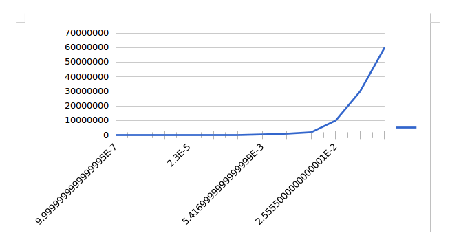
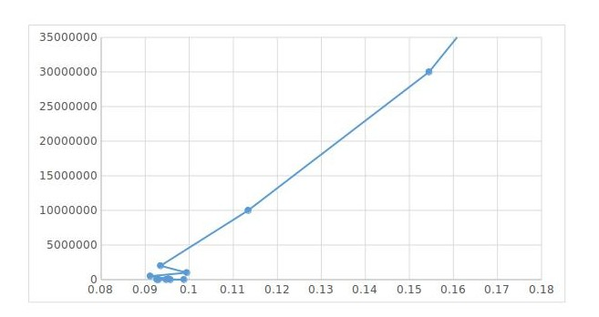

<<<<<<< HEAD
# A continuación se muestra un comparativo entre el procesamiento por medio de CPU y el hecho a partir de una GPU.
=======
#A continuación se muestra un comparativo entre el procesamiento por medio de CPU y el hecho a partir de una GPU.

##Método de comparativo:
>>>>>>> b26e395215b3e401ea27d4c62c2ef5f89e95ce9b

## Método de comparativo:

Para realizar las pruebas se tomaron 10 datos diferentes para un tamaño de vector en específico, se tienen 12 valores   diferentes para dicho tamaño, para ver el comportamiento en términos de tiempo que resulta al ejecutar dos algoritmos diferentes tanto en el ámbito secuencial (CPU) como en el paralelo (GPU).
Además se hizo una prueba extra con valores más grandes para la GPU, que se traduce en mayor número de bloques y de hilos en las pruebas.

<<<<<<< HEAD
## Tabla de datos tomados al ejecutar el algoritmo de suma en la CPU:
=======
##Tabla de datos tomados al ejecutar el algoritmo de suma en la CPU:
>>>>>>> b26e395215b3e401ea27d4c62c2ef5f89e95ce9b

|       Número de datos | Tiempo        |
|---------------------|
|1           |0,000001|
|10          |0,000001|
|100         |0,000003|
|1000        |0,000023|
|10000       |0,000088|
|100000      |0,000919|
|500000      |0,005417|
|1000000     |0,013998|
|2000000     |0,017278 |
|10000000    |0,025555|
|30000000    |0,07598|
|60000000    |0,155498|

<<<<<<< HEAD
## Tabla de datos tomados al ejecutar el algoritmo de suma en la GPU:

=======

##Tabla de datos tomados al ejecutar el algoritmo de suma en la GPU:

>>>>>>> b26e395215b3e401ea27d4c62c2ef5f89e95ce9b

|       Número de datos | Tiempo        |
|---------------------|
|1           |0,092663|
|10          |0,094731|
|100         |0,098808|
|1000        |0,095708|
|10000       |0,093072|
|100000      |0,095302|
|500000      |0,091146|
|1000000     |0,099437|
|2000000     |0,093488|
|10000000    |0,113389|
|30000000    |0,154458|
|60000000    |0,192637|

Los siguientes gráficos nos muestran el comportamiento de los datos en ambas partes:

<<<<<<< HEAD
# Gráfico tabla de datos tomados al ejecutar el algoritmo de suma en la CPU:

## Número de datos vs Tiempo:
=======
#Gráfico tabla de datos tomados al ejecutar el algoritmo de suma en la CPU:

##Número de datos vs Tiempo:
>>>>>>> b26e395215b3e401ea27d4c62c2ef5f89e95ce9b

<<<<<<< HEAD
# Gráfico tabla de datos tomados al ejecutar el algoritmo de suma en la GPU:

## Número de datos vs Tiempos:
=======
#Gráfico tabla de datos tomados al ejecutar el algoritmo de suma en la GPU:

##Número de datos vs Tiempos:
>>>>>>> b26e395215b3e401ea27d4c62c2ef5f89e95ce9b

## Análisis:

-Los tiempos en GPU desde una primera instancia son más altos que los de la CPU por el hecho de tener que transferir el uso de la CPU a la GPU por medio de cudaMemcopy.

-En este método no se aprovecha al máximo la computación en paralelo ya que en estos procesos tan simples a la CPU le cuesta menos porque no hay que hacer la copia en memoria ya mencionada.
